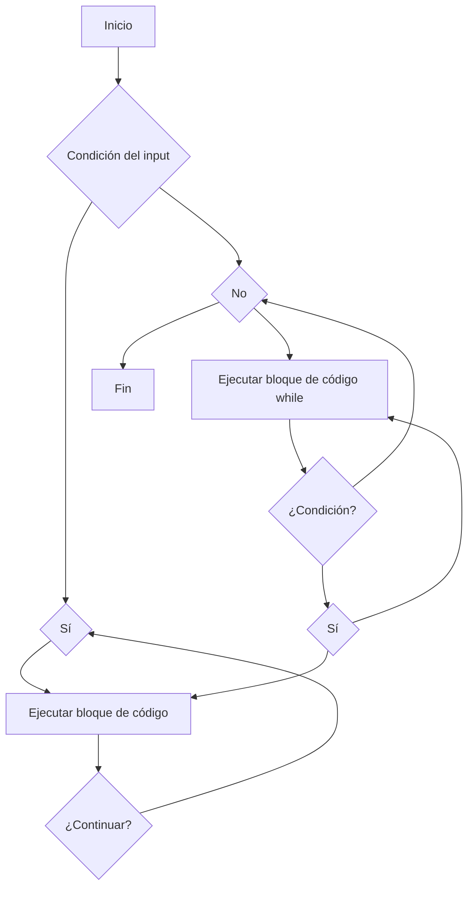

# Unidad III:   Programando con R

# Clase del Martes

La programación implica escribir sistemas de instrucciones relativamente complejos.
Hay dos estilos amplios de programación: el estilo **imperativo** implica encadenar 
instrucciones que le dicen a la computadora qué hacer. El estilo **declarativo** implica
escribir una descripción del resultado final, sin dar detalles sobre cómo
para llegar allí.

##  **Control del flujo "flow" DETERMINISTA**



**Explicación del diagrama:**

* El diagrama comienza en el nodo **A (Inicio)**.
* Desde **A**, hay una pregunta que decide si se debe usar un bucle **for** o un bucle **while**.
* Si la respuesta a la pregunta es **sí** (nodo **B**), el flujo pasa al nodo **C (Ejecutar bloque de código)**.
* Dentro del bucle **for**, el bloque de código se ejecuta (nodo **D**).
* Luego, hay otra pregunta que decide si se debe continuar con el bucle (nodo **E**).
* Si la respuesta es **sí**, el flujo vuelve al nodo **C** para ejecutar el bloque de código nuevamente.
* Si la respuesta es **no**, el flujo sale del bucle **for** y pasa al nodo **F (No)**.
* Si la respuesta a la pregunta inicial (nodo **B**) es **no**, el flujo pasa directamente al nodo **G (Ejecutar bloque de código while)**.
* Dentro del bucle **while**, el bloque de código se ejecuta (nodo **D**).
* Luego, la condición del bucle se evalúa en el nodo **H (¿Condición?)**.
* Si la condición es **sí**, el flujo vuelve al nodo **G** para ejecutar el bloque de código nuevamente.
* Si la condición es **no**, el flujo sale del bucle **while** y pasa al nodo **F (No)**.
* Finalmente, el flujo termina en el nodo **J (Fin)**.
 
# Primeros pasos en programación en R

El dominio de la programación en R es una competencia esencial en la formación de un estudiante de Magíster en Ciencia de Datos. En este capítulo, aprenderemos a controlar el flujo de ejecución mediante estructuras como `for()`, `while()`, `if()` y `repeat()`, aplicables en tareas como la iteración sobre datos, la evaluación condicional de modelos y la automatización de procesos analíticos. Se introducirá la definición de funciones propias con `function()`, el uso de `replicate()` para simulaciones estadísticas, y técnicas de depuración con `debug()` y `browser()` para asegurar la corrección del código. Al finalizar este capítulo, el estudiante será capaz de construir scripts modulares, eficientes y mantenibles, fundamentales para resolver problemas complejos de clasificación, predicción o procesamiento masivo de datos.

## SESION 1: Control del flujo de operaciones por medio de loops

### Uso de `for`

::: {align="center"}
para (`for`) cada elemento\_`i` en una lista:

     hacer algo con elemento\_`i`
:::

### Ejemplo de n!

El factorial n! cuenta cuántas formas diferentes se pueden ordenar  n objetos diferentes. Se define como:

$$
n! = 1 \cdot 2 \cdot 3 \cdots (n - 1) \cdot n
$$

Una forma de calcularlo sería usar una declaración `for()`. Por ejemplo, podríamos encontrar el valor de 100! usando el siguiente código:

```{r}
n <- 100
result <- 1
for (i in 1:n)
result <- result * i
result
```

### Ejemplo Fibonacci

La secuencia de Fibonacci es una secuencia famosa en matemáticas. Los dos primeros elementos se definen como {1, 1}. Los elementos subsecuentes se definen como la suma de los dos elementos anteriores.

Por ejemplo:

\- El tercer elemento es 2 (= 1 + 1)

\- El cuarto elemento es 3 (= 1 + 2)

\- El quinto elemento es 5 (= 2 + 3)

\- Y así sucesivamente.

Para obtener los primeros 12 números de Fibonacci en R, podemos usar:

```{r}

Fibonacci <- numeric(12) # vector con ceros para completar
Fibonacci[1] <- Fibonacci[2] <- 1
for (i in 3:12)
Fibonacci[i] <- Fibonacci[i - 2] + Fibonacci[i - 1]

print(Fibonacci)
```

Visualización de los números

```{r}
# Crear ángulos para la espiral
angles <- seq(0, 4 * pi, length.out = length(Fibonacci))

# Graficar en coordenadas polares
library(ggplot2)

# Crear un data frame
df <- data.frame(
  angle = angles,
  radius = Fibonacci,
  label = Fibonacci
)

# Convertir a coordenadas cartesianas para ggplot
df$x <- df$radius * cos(df$angle)
df$y <- df$radius * sin(df$angle)

# Graficar
ggplot(df, aes(x, y)) +
  geom_path(color = "blue") +
  geom_point(size = 3, color = "red") +
  geom_text(aes(label = label), vjust = -1, size = 4) +
  coord_equal() +
  theme_minimal() +
  ggtitle("Espiral de Fibonacci")

```

### Uso de `if`

::: {align="center"}
if (condición){ comandos cuando es VERDADERO}else{comandos cuando es FALSO}
:::

```{r}
edad <- 20

if (edad >= 18) {
  print("Eres mayor de edad")
} else {
  print("Eres menor de edad")
}

```

#### Creación de una función condicionada

```{r}

x1 <- rnorm(30, 1,2)
x2 <- 2 + 10*x1 + rnorm(30, 0,10)

# pequeña función
corplot <- function(x, y, plotit) {
if (plotit == TRUE) plot(x, y)
cor(x, y)
}

corplot(x1, x2,FALSE)

```

### Uso de `while`

::: {align="center"}
establecer x en 1 mientras (x \<= 5): mostrar x aumentar x en 1
:::

```{r}
x <- 1

while (x <= 5) {
  print(x)
  x <- x + 1
}

```

### ¿Cuantos lanzamientos de una moneda requiero realizar para obtener 10 caras ?

```{r}

# Inicializamos variables
caras <- 0
lanzamientos <- 0

# Bucle while: se repite hasta obtener 10 caras
while (caras < 10) {
  lanzamiento <- sample(c("cara", "cruz"), 1)
  lanzamientos <- lanzamientos + 1
  if (lanzamiento == "cara") {
    caras <- caras + 1
  }
}

# Resultado
cat("Se necesitaron", lanzamientos, "lanzamientos para obtener 10 caras.\n")


```

### Uso de `repeat` and `break`

::: {align="center"}
repetir: mostrar x aumentar x en 1 hasta que (x \> 5)
:::

```{r}
x <- runif(1,0,7)

repeat {
  print(x)
  x <- x + 1
  if (x > 14) break
}

```

En este ejemplo se utiliza un bucle `repeat` junto con `break` para recorrer el conjunto de datos `mtcars` y encontrar el primer automóvil cuyo rendimiento en millas por galón (`mpg`) sea superior a 30. El bucle se ejecuta indefinidamente hasta que se cumple la condición deseada, momento en el cual se imprime el nombre del auto y su valor de `mpg`, y se interrumpe la ejecución con `break`. Este enfoque es útil cuando se desea identificar rápidamente el primer caso que cumple un criterio específico dentro de un conjunto de datos.

```{r}

# Cargar el dataset
data(mtcars)

# Convertir los nombres de fila en una columna para poder accederlos
mtcars$car <- rownames(mtcars)

# Inicializar índice
i <- 1

repeat {
  if (mtcars$mpg[i] > 30) {
    cat("El primer auto con mpg > 30 es:", mtcars$car[i], "con", mtcars$mpg[i], "mpg.\n")
    break
  }
  i <- i + 1
}

```

### Aplicación de loops al analisis de datos

En análisis de datos, es común encontrarse con valores faltantes (`NA`) que deben ser tratados antes de realizar cualquier análisis estadístico. Este ejemplo utiliza el dataset `airquality`, incluido en R, que contiene mediciones diarias de calidad del aire en Nueva York. El objetivo es demostrar cómo usar los bucles `for`, `while`, `repeat` y `break` para:

1.  **Detectar columnas con datos faltantes**.
2.  **Imputar los valores faltantes con la media de cada variable**.
3.  **Verificar que no queden `NA`**.
4.  **Generar un resumen estadístico del dataset limpio**.

Este caso nos permitirá practicar estructuras de control en R dentro de un contexto realista y útil para la limpieza de datos.

```{r}

# Cargar dataset
data("airquality")

```
```{}

str(airquality)
ncol(airquality)
nrow(airquality)
nombres <- names(airquality)

airquality[nombres[1]]
airquality["Ozone"]
airquality[["Ozone"]]
airquality[[1]]

if(FALSE){print("Hello world")}

is.na(airquality[["Ozone"]])
any(is.na(airquality[["Ozone"]]))

# La matriz completa
any(is.na(airquality))

# Operadores Logicos
if(4>10 && 4>100) {print("Correcto")}
if(4<10 && 4<100) {print("Correcto")}

```
```{r}
str(airquality)
ncol(airquality)
nrow(airquality)
nombres <- names(airquality)

airquality[nombres[1]]
airquality["Ozone"]
airquality[["Ozone"]]
airquality[[1]]

if(FALSE){print("Hello world")}

is.na(airquality[["Ozone"]])
any(is.na(airquality[["Ozone"]]))

# La matriz completa
any(is.na(airquality))

# Operadores Logicos
if(4>10 && 4>100) {print("Correcto")}
if(4<10 && 4<100) {print("Correcto")}

```

```         
cat("Columnas con valores NA:\n")
for (col in names(airquality)) {
  if (any(is.na(airquality[[col]]))) {
    cat("-", col, "\n")
  }
}
```

```{r}

# 1. Identificar columnas con NA usando un bucle for
cat("Columnas con valores NA:\n")
for (col in names(airquality)) {
  if (any(is.na(airquality[[col]]))) {
    cat("-", col, "\n")
  }
}
```

```{}
# 2. Imputar valores NA con la media de la columna usando while
col_index <- 1
while (col_index <= ncol(airquality)) {
  columna <- airquality[[col_index]]
  if (is.numeric(columna) && any(is.na(columna))) {
    media <- mean(columna, na.rm = TRUE)
    columna[is.na(columna)] <- media
    airquality[[col_index]] <- columna
  }
  col_index <- col_index + 1
}

```

```{r}
# 2. Imputar valores NA con la media de la columna usando while
col_index <- 1
while (col_index <= ncol(airquality)) {
  columna <- airquality[[col_index]]
  if (is.numeric(columna) && any(is.na(columna))) {
    media <- mean(columna, na.rm = TRUE)
    columna[is.na(columna)] <- media
    airquality[[col_index]] <- columna
  }
  col_index <- col_index + 1
}

```

```{}
repeat {
  if (any(is.na(airquality))) {
    cat("Aún hay valores NA.\n")
    break
  } else {
    cat("Todos los valores NA han sido imputados correctamente.\n")
    break
  }
}
```

```{r}
# 3. Verificar que no queden NA usando repeat y break
repeat {
  if (any(is.na(airquality))) {
    cat("Aún hay valores NA.\n")
    break
  } else {
    cat("Todos los valores NA han sido imputados correctamente.\n")
    break
  }
}

```

```{r}
# 4. Resumen estadístico del dataset limpio
cat("\nResumen estadístico del dataset limpio:\n")
print(summary(airquality))
```

## Reproduciendo operaciones con functiones `function(arg)`

### ¿Qué es una función en R?

Una **función** en R es un bloque de código que realiza una tarea específica. Sirve para **organizar** y **reutilizar** código de forma más clara y eficiente.

#### ¿Cómo se define una función?

Una función se define con la palabra clave `function`, seguida de paréntesis con los **argumentos** (si los hay), y luego un bloque de código entre llaves `{ }`.

### Definir una función

``` r
definir función con nombre:
    (opcionalmente con argumentos)
    {
        hacer algo con esos argumentos
        devolver un resultado
    }
```

### Ejemplo de función

```{}
corplot_v2 <- function(x, y, plotit = TRUE, method = "pearson", main = NULL, xlab = NULL, ylab = NULL) {
  # Validaciones
  if (!is.numeric(x) || !is.numeric(y)) stop("Ambos vectores deben ser numéricos.")
  if (length(x) != length(y)) stop("Los vectores deben tener la misma longitud.")
  if (!method %in% c("pearson", "spearman", "kendall")) stop("Método no válido.")
  
  # Gráfico opcional
  if (plotit) {
    plot(x, y, main = main, xlab = xlab, ylab = ylab)
  }
  
  # Calcular correlación
  return(cor(x, y, method = method))
}
```

```{r}

corplot_v2 <- function(x, y, plotit = TRUE, method = "pearson", main = NULL, xlab = NULL, ylab = NULL) {
  # Validaciones
  if (!is.numeric(x) || !is.numeric(y)) stop("Ambos vectores deben ser numéricos.")
  if (length(x) != length(y)) stop("Los vectores deben tener la misma longitud.")
  if (!method %in% c("pearson", "spearman", "kendall")) stop("Método no válido.")
  
  # Gráfico opcional
  if (plotit) {
    plot(x, y, main = main, xlab = xlab, ylab = ylab)
  }
  
  # Calcular correlación
  return(cor(x, y, method = method))
}
```

```{r}
corplot_v2(x1,x2,TRUE)
```

### Output con multiples objetos

```{}
library(ggplot2)

corplot_multi <- function(x, y, alpha = 0.05) {
  if (!is.numeric(x) || !is.numeric(y)) stop("Ambos vectores deben ser numéricos.")
  if (length(x) != length(y)) stop("Los vectores deben tener la misma longitud.")
  
  # Calcular correlación y prueba
  test <- cor.test(x, y)
  
  # Crear gráfico con ggplot2
  df <- data.frame(x = x, y = y)
  p <- ggplot(df, aes(x, y)) +
    geom_point() +
    geom_smooth(method = "lm", se = FALSE, col = "blue") +
    ggtitle("Gráfico de dispersión con línea de tendencia")
  
  # Salida como lista con descripciones
  return(list(
    correlacion = test$estimate,
    p_valor = test$p.value,
    significativa = test$p.value < alpha,
    grafico = p
  ))
}

```

```{r}
library(ggplot2)

corplot_multi <- function(x, y, alpha = 0.05) {
  if (!is.numeric(x) || !is.numeric(y)) stop("Ambos vectores deben ser numéricos.")
  if (length(x) != length(y)) stop("Los vectores deben tener la misma longitud.")
  
  # Calcular correlación y prueba
  test <- cor.test(x, y)
  
  # Crear gráfico con ggplot2
  df <- data.frame(x = x, y = y)
  p <- ggplot(df, aes(x, y)) +
    geom_point() +
    geom_smooth(method = "lm", se = FALSE, col = "blue") +
    ggtitle("Gráfico de dispersión con línea de tendencia")
  
  # Salida como lista con descripciones
  return(list(
    correlacion = test$estimate,
    p_valor = test$p.value,
    significativa = test$p.value < alpha,
    grafico = p
  ))
}

```

```{r}
# res <- corplot_multi(mtcars$mpg, mtcars$hp)
# print(res$correlacion)
# print(res$significativa)
# print(res$grafico)

```

```{r}

corplot_multi(x1,x2)$p
```

### Output en clase `S3`

En R, los **objetos** pueden pertenecer a diferentes **clases**, que determinan cómo se comportan y cómo se interpretan por funciones genéricas como `print()`, `summary()` o `plot()`. Estas clases permiten organizar y estructurar los datos de forma coherente. Una de las formas más comunes y flexibles de definir clases en R es mediante el sistema **S3**, que es simple, dinámico y ampliamente utilizado.

El sistema **S3** no requiere una definición formal de clases. En cambio, se basa en la asignación de un atributo de clase a un objeto y en la creación de funciones específicas para esa clase. Por ejemplo, si se crea un objeto de clase `"corplot_result"`, se puede definir una función `print.corplot_result()` que se ejecutará automáticamente cuando se use `print()` sobre ese objeto. Esto permite personalizar el comportamiento de funciones genéricas según el tipo de objeto.

```{}
# Crear una función que devuelva un objeto con clase S3
corplot_s3 <- function(x, y) {
  resultado <- list(
    correlacion = cor(x, y),
    resumen = summary(lm(y ~ x))
  )
  class(resultado) <- "corplot_result"  # Asignar clase S3
  return(resultado)
}

# Definir un método print específico para la clase
print.corplot_result <- function(obj) {
  cat("Correlación:", obj$correlacion, "\n")
  cat("Resumen del modelo lineal:\n")
  print(obj$resumen)
}
```

```{r}

# Crear una función que devuelva un objeto con clase S3
corplot_s3 <- function(x, y) {
  resultado <- list(
    correlacion = cor(x, y),
    resumen = summary(lm(y ~ x))
  )
  class(resultado) <- "corplot_result"  # Asignar clase S3
  return(resultado)
}

# Definir un método print específico para la clase
print.corplot_result <- function(obj) {
  cat("Correlación:", obj$correlacion, "\n")
  cat("Resumen del modelo lineal:\n")
  print(obj$resumen)
}
```

```{r}
res <- corplot_s3(mtcars$mpg, mtcars$hp)
print(res)  # Llama automáticamente a print.corplot_result()
```

## *Consejos de programación miscelánea*


### La limpieza cuenta del código

Evitar errores en los códigos
```r
x1<-a+b+c
y12< -a+b+c
```

Código espaciado y simetrico
```r
x1 <- a + b + c
y12 < -a + b + c

```

### Diseño de arriba hacia abajo


 

```r
# 1. Use a merge sort to sort a vector
mergesort <- function (x) {
  ## 2: sort x into result
  return (result)
}
```

```r
# 1. Use a merge sort to sort a vector
mergesort <- function (x) {
  # 2: sort x into result
  ## 2.1: split x in half
  ## 2.2: sort each half
  ## 2.3: merge the 2 sorted parts into a sorted result
  return (result)
}

```

```r
# 2.1: split x in half
len <- length(x)
x1 <- x[1:(len %/% 2)]
x2 <- x[(len %/% 2 + 1):len]
```

```r
# 1. Use a merge sort to sort a vector
mergesort <- function (x) {
  # Check for a vector that doesn't need sorting
  len <- length(x)
  if (len < 2) result <- x
  else {
    # 2: sort x into result
    # 2.1: split x in half
    y <- x[1:(len %/% 2)]
    z <- x[(len %/% 2 + 1):len]
    ## 2.2: sort y and z
    ## 2.3: merge y and z into a sorted result
  }
  return(result)
}

```

```r

# 2.2: sort y and z
y <- mergesort(y)
z <- mergesort(z)
```

```r
# 1. Use a merge sort to sort a vector
mergesort <- function (x) {
# Check for a vector that doesn't need sorting
len <- length(x)
if (len < 2) result <- x
            else {
# 2: sort x into result
# 2.1: split x in half
y <- x[1:(len %/% 2)]
z <- x[(len %/% 2 + 1):len]
# 2.2: sort y and z
y <- mergesort(y)
z <- mergesort(z)
# 2.3: merge y and z into a sorted result
result <- c()
## 2.3.1: while (some are left in both piles)
## 2.3.2: put the smallest first element on the end
## 2.3.3: remove it from y or z
## 2.3.4: put the leftovers onto the end of result
}
return(result)
}

```

```r
# 1. Use a merge sort to sort a vector
mergesort <- function (x) {
  # Check for a vector that doesn't need sorting
  len <- length(x)
  if (len < 2) result <- x
  else {
    # 2: sort x into result
    
    # 2.1: split x in half
    y <- x[1:(len %/% 2)]
    z <- x[(len %/% 2 + 1):len]
    # 2.2: sort y and z
    y <- mergesort(y)
    z <- mergesort(z)
    # 2.3: merge y and z into a sorted result
    result <- c()
    # 2.3.1: while (some are left in both piles)
    while (min(length(y), length(z)) > 0) {
      # 2.3.2: put the smallest first element on the end
      # 2.3.3: remove it from y or z
      if (y[1] < z[1]) {
        result <- c(result, y[1])
        y <- y[-1]
      } else {
        result <- c(result, z[1])
        z <- z[-1]
      }
    }
    # 2.3.4: put the leftovers onto the end of result
    if (length(y) > 0)
      result <- c(result, y)
    else
      result <- c(result, z)
  }
  return(result)
}


```

Ordenando una mustra de un modelo Normal y Poisson
```r
mergesort(rnorm(10,3,1))
```

```r
mergesort(rpois(10,5))
```


### Reconociendo errores

```r
sqrt(var)

```

```r

x <- c(2,4,5,6,8,3,3,1)
mean("x")

```

```r

mean(X)

```

```r

if (x == NA) print("NA")

```


### Identificar la causa del error


### Depuración de los operadores %>% magrittr

- **Aplicquemos este desafio**: Elija un número entre 1 y 10 y manténgalo en secreto. Multiplica tu número por 3. Suma 3. Multiplica por 3 nuevamente. 
Pronostico: Los dígitos de tu número actual suman 9.


```r
library(magrittr)
x <- sample(1:10, 1)
x %>% multiply_by(3) %>% add(5) %>% multiply_by(3)

```

Los dígitos no suman 9! Para depurar esto, podemos reescribir el secuencia, guardando resultados intermedios


```r
r1 <- x %>% multiply_by(3); r1

r2 <- r1 %>% add(5); r2

r3 <- r2 %>% multiply_by(3); r3

```
Ahora es obvio que no sumamos 3 en el segundo paso, sumamos 5.

La otra forma de depurar esto es insertar la función magrittr debug_pipe() en la tubería, por ejemplo.
Esto llama al navegador browser() entre cada paso con el valor actual almacenado en x. Luego pasa x al siguiente paso sin cambios. Podemos imprimir x y reconocer cuando no es el valor correcto. 

```r
x %>% multiply_by(3) %>% debug_pipe() %>% add(5) %>%
  debug_pipe() %>% multiply_by(3)

```

Podemos comprobar que nuestra solución es correcta haciendo el cálculo para cada opción inicial posible:

```r
1:10 %>% multiply_by(3) %>% add(3) %>% multiply_by(3)
```
y ahora vemos otro error: si se hubiera elegido 10, la suma de dígitos sería 18, por lo que deberíamos reformular el truco de magia para seguir sumando dígitos hasta llegar a un solo dígito.


## *Programación eficiente*

- Una función o programación en R es ineficiente si su ejecución demora mucho tiempo y una gran cantidad de memoria.
  
Por ejemplo, la suma de dos vectores se podría hacer de la siguiente manera

```r
X <- rnorm(100000) # Xi ˜ N(0, 1) i=1, ..., 100,000
Y <- rnorm(100000) # Yi ˜ N(0, 1) i=1, ..., 100,000
Z <- c()
for (i in 1:100000) {
  Z <- c(Z, X[i] + Y[i]) # this takes about 25 seconds
}

```

```r

Z <- rep(NA, 100000)
for (i in 1:100000) {
  Z[i] <- X[i] + Y[i] # this takes about 0.15 seconds
}

Z <- X + Y
```


### Mide el tiempo que tarda tu programa

Usamos la función **system.time** para medir el tiempo 
de ejecución.

```r
X <- rnorm(100000)
Y <- rnorm(100000)
Z <- c()
system.time({
for (i in 1:100000) {
Z <- c(Z, X[i] + Y[i])
}
})
```


```r
Z <- rep(NA, 100000)
system.time({
for (i in 1:100000) {
Z[i] <- X[i] + Y[i]
}
})

system.time(Z <- X + Y)

```


```r

```


## *Referencias*
1.  Introduction  to  Scientific  Programming and Simulation  Using R: [https://nyu-cdsc.github.io/learningr/assets/simulation.pdf](https://nyu-cdsc.github.io/learningr/assets/simulation.pdf)
2.  Advanced R: [https://adv-r.hadley.nz/](https://adv-r.hadley.nz/)

